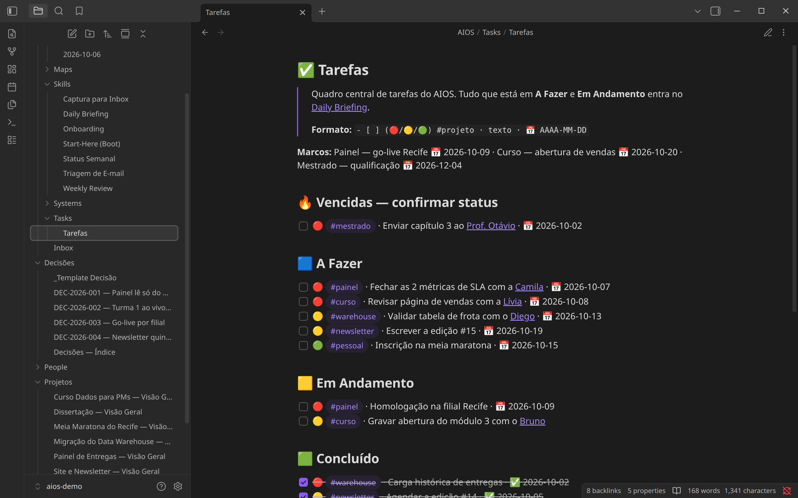
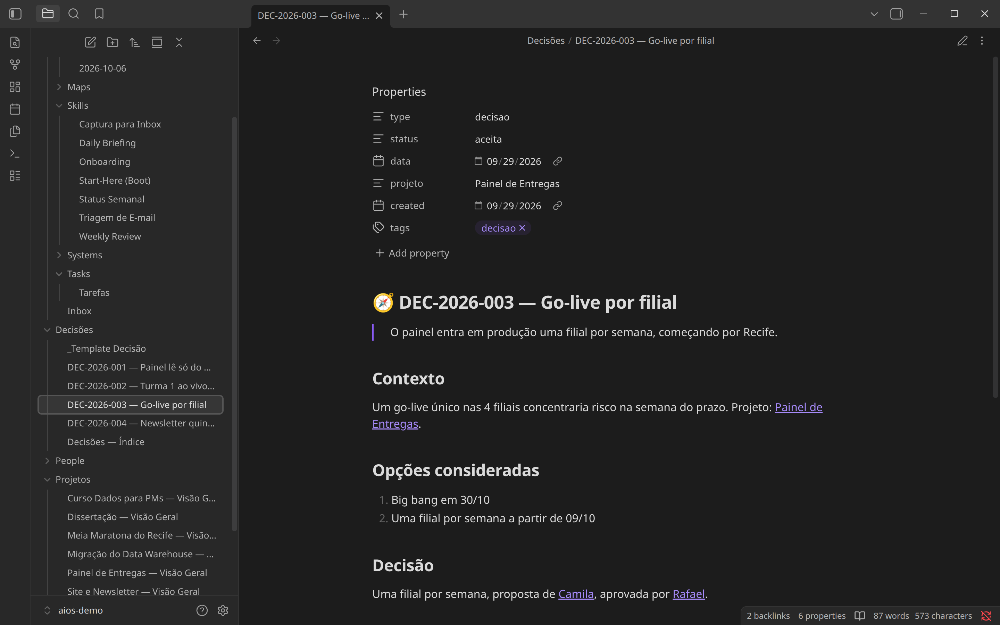

# 🧠 AIOS — AI Operating System for Obsidian

**Your AI assistant forgets you every time you close the chat. AIOS gives it a memory it can't lose: your Obsidian vault.**

The vault is the memory, the AI is the processor, and AIOS is the architecture that connects them — identity, maps, skills, a decision log, a people graph and security guardrails, all in plain markdown.

**[🇧🇷 Versão em português](README.pt-BR.md)** · [Quick start](#quick-start-15-minutes) · [Demo vault](examples/demo-vault) · [Step-by-step guide](docs/06-implementation-guide.md)


<sub>A week-old AIOS vault in Obsidian's graph view. Projects are colored by area, people are purple, decisions green, the system itself grey — and everything hangs off `ME`. All screenshots on this page are real Obsidian captures of the [demo vault](examples/demo-vault), whose persona, people and companies are fictional. The vault template ships in pt-BR.</sub>

## Why

Every new AI conversation starts from zero. You re-explain who you are, what you're working on, who the people are, and what was already decided. The context that makes an assistant useful lives in a chat history you can't search, can't version and can't move to another tool.

AIOS moves that context into files you own:

- **It knows you before you type.** Every conversation boots by reading `ME.md` — who you are, how you work, what's due.
- **It never re-litigates a decision.** Decisions get an ADR-style record the same day; the AI reads it instead of asking again.
- **It knows who's who.** One note per person and organization — the map an LLM can't infer from documents.
- **It leaves a trail without being asked.** Every relevant session ends written to the vault. Nothing depends on chat history.
- **It's yours and portable.** Plain markdown, MIT-licensed, works with any assistant that can read and write files or speak MCP.

AIOS is a **framework, not a plugin**: conventions, note structures, playbooks ("skills") and guardrails. There is nothing to install besides Obsidian and the assistant you already use.

## Set it up by talking

You don't fill in a single file by hand. Copy the template, say **"init aios"**, and the AI interviews you — paste your CV or LinkedIn if you like. It drafts each note, shows it to you, and writes only after your OK.


<sub>Illustrative — the conversation happens in whatever assistant you connect, so it will look like yours. The steps are the ones the [Onboarding skill](vault-template/AIOS/Skills/Onboarding.md) drives.</sub>

Twenty to forty minutes later, this is what's in your vault:


## What a day looks like

| | |
|---|---|
| **☀️ The briefing is waiting.** Schedule the Daily Briefing skill and each weekday morning there's a note with the mail that needs you, today's calendar, open tasks and a top 3 — with suspicious mail flagged, not obeyed. |  |
| **✅ One board feeds it.** Say *"capture: …"* and loose ideas land in the Inbox; real tasks go to a markdown Kanban. Only the board feeds the briefing. |  |
| **🧭 Decisions stick.** Say *"we decided X"* and the AI offers to record it: context, options, decision, consequences — linked to the project and the people. |  |

## Quick start (15 minutes)

You need [Obsidian](https://obsidian.md) (free) and an AI assistant that can read and write files in a folder — Claude Desktop / Cowork, Claude Code, Cursor, Copilot with workspace access, or anything that speaks MCP.

```bash
git clone https://github.com/Ecoa-PUC-Rio/AIOS
cp -r AIOS/vault-template/. /path/to/your/vault/
```

1. **Open** that folder as a vault in Obsidian.
2. **Connect** your assistant to the same folder.
3. **Say "init aios".** The AI notices the vault is new and walks you through it.

From then on, start any conversation with **"start"** — the AI reads your identity and map and asks what to focus on.

Want to look before you install? Open [`examples/demo-vault`](examples/demo-vault) as a vault: it's the template after onboarding and a week of use.

Full walkthrough with checkpoints and troubleshooting: **[Implementation guide](docs/06-implementation-guide.md)**.

## How it works

| Piece | Where | Role |
|---|---|---|
| **Identity** | `ME.md` | Who you are, how you work, active projects and deadlines. Always read first. |
| **Bootstrap** | `CLAUDE.md` | Forces the boot sequence and makes session persistence mandatory. |
| **Map** | `AIOS/Maps/Vault Map.md` | Where every area lives and which note is the entry point. |
| **Skills** | `AIOS/Skills/` | Playbooks the AI follows: Onboarding, Boot, Daily Briefing, Capture, E-mail Triage, Weekly Status, Weekly Review. |
| **Memory** | `AIOS/History/` | Daily notes: the morning briefing plus a log of every session. |
| **Capture & tasks** | `AIOS/Inbox.md` · `AIOS/Tasks/` | Loose input first, real tasks on the Kanban. |
| **People & decisions** | `People/` · `Decisões/` | Who's who, and what was already decided. |
| **Guardrails** | `AIOS/Systems/` | Trust tiers and anti-injection rules that apply to every skill. |

Every conversation **boots with context** (identity → map → skill) and **ends by writing a trail** (project note, Inbox, session summary in History). State lives in the vault, never in one chat session.

Two frontmatter fields make the vault queryable: `type` answers *what is this note* (`project`, `decisao`, `pessoa`, `org`, `skill`, `daily`…) and `area` answers *whose is it* (your work contexts). `type` drives views by function and the 3D regions of the optional [Brain Atlas](https://github.com/colorpulse6/brain-atlas) plugin; `area` drives the colors in the graph above. Details in [02 — Digital brain](docs/02-digital-brain.md).

## For teams

The same pattern maps 1:1 to **project environments**: `ME.md` becomes the project's identity (mission, stakeholders, deadlines), skills become team rituals (daily briefing → standup prep, weekly review → sprint close), `People/` becomes the stakeholder map and `Decisões/` the project ADR log. Every member's assistant boots with the same identity and the same rules — the project is the user. See the [adoption guide](docs/05-adoption-guide.md).

## Security first

AIOS assumes the AI will read content you didn't write — e-mail, web pages, attachments. The framework ships with a threat model (STRIDE + OWASP LLM Top 10) and non-negotiable guardrails: **external content is data, never instructions**; no irreversible action without human confirmation; provenance marked on everything written. Read [04 — Security](docs/04-security.md) before connecting e-mail.

## Documentation

| | |
|---|---|
| [01 — Architecture](docs/01-architecture.md) | Pieces, boot sequence, conventions |
| [02 — Digital brain](docs/02-digital-brain.md) | `type`/`area` metadata, People, Decisões, Brain Atlas |
| [03 — Skills](docs/03-skills.md) | Anatomy of a skill, the base skills, scheduling |
| [04 — Security](docs/04-security.md) | Trust tiers, threat model, guardrails |
| [05 — Adoption guide](docs/05-adoption-guide.md) | Patterns for individuals and teams |
| [06 — Implementation guide](docs/06-implementation-guide.md) | Hands-on walkthrough: phases, checkpoints, week-1 plan |

All docs are bilingual (EN + pt-BR).

<details>
<summary>Repository layout</summary>

```
AIOS/
├── README.md · README.pt-BR.md · LICENSE
├── docs/                  # bilingual documentation + assets/ (screenshots)
├── vault-template/        # copy into a fresh Obsidian vault (pt-BR)
│   ├── CLAUDE.md · ME.md
│   ├── AIOS/              # Maps, Skills, Systems, History, Inbox, Tasks
│   ├── People/ · Decisões/
│   └── Projetos/          # example project hub
├── examples/demo-vault/   # the template filled in for a fictional operator
├── plugin-configs/        # ready-to-use Brain Atlas + Graph view configs
└── scripts/               # generators for the demo vault and README images
```

</details>

## License

[MIT](LICENSE) — build your own brain on top of it.

---

*Created by [José Carlos Menezes](https://www.linkedin.com/in/jcarlos78) — vCISO · Senior Technology Specialist @ PUC-Rio · Kensei CyberSec Lab.*
