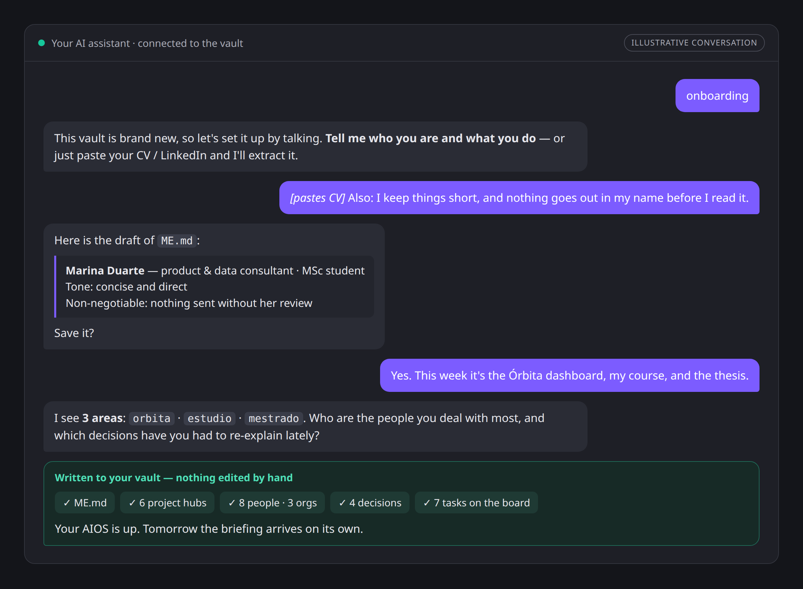
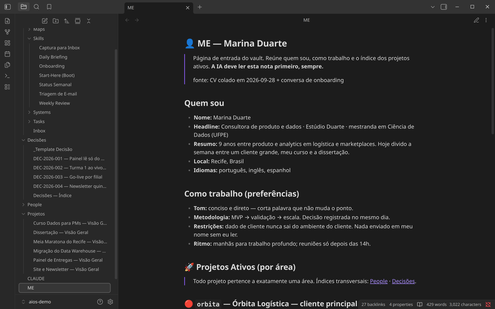
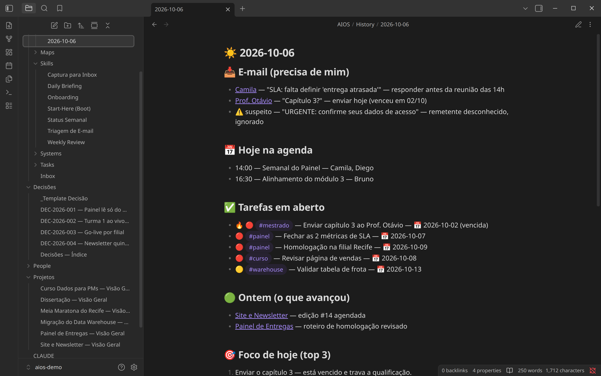
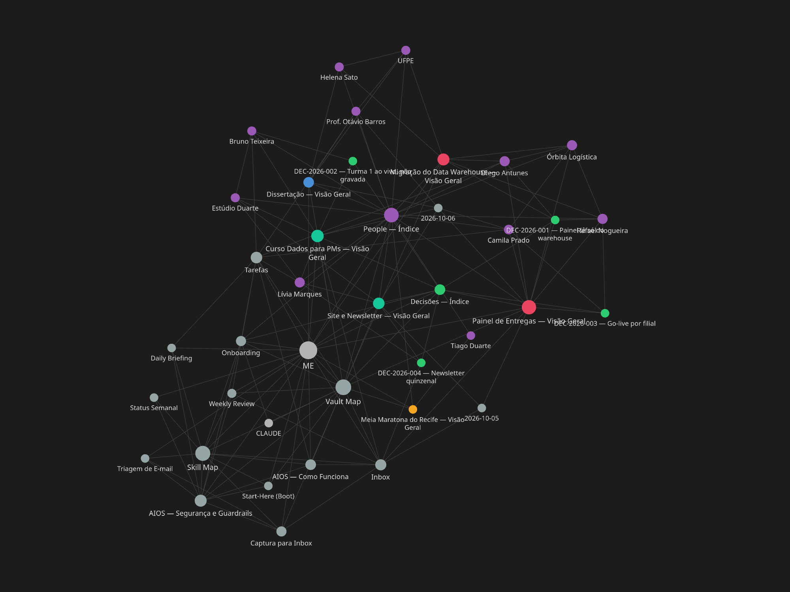

# 06 — Implementation Guide (step by step)

*[Versão em português → 06-implementation-guide.pt-BR.md](06-implementation-guide.pt-BR.md)*

From zero to a working AIOS in **7 phases**. You don't need to be technical: if you can copy a folder and hold a conversation, you can do this. Nothing here is written by hand — after the template is in place, the AI does the typing.

## The path at a glance

| Phase | What happens | Time | You end up with |
|---|---|---|---|
| 0 | Install Obsidian, pick your assistant | 10 min | The two tools you need |
| 1 | Copy the template into a vault | 10 min | The folder structure |
| 2 | Connect the AI to the vault | 15 min | An assistant that offers the onboarding by itself |
| 3 | **The onboarding conversation** | 20–40 min | `ME.md`, areas and project hubs — **a working AIOS** |
| 4 | Tell it about people and decisions | ongoing | A brain that knows who's who and what was decided |
| 5 | Test and schedule the skills | 30 min | A briefing that arrives on its own |
| 6 | Visualization *(optional)* | 15 min | Your vault as a colored graph / 3D brain |
| 7 | Team setup *(optional)* | ~1 h per project | A shared project brain |

**In a hurry?** Phases 0–3 are the whole product: about an hour, and you have a system that boots with your context. Everything after that happens during your first week of normal use.

**Want to see the destination first?** Open [`examples/demo-vault`](../examples/demo-vault) as a vault in Obsidian — it is this guide already followed, for a fictional operator. The screenshots below come from it.

---

## Phase 0 — Prerequisites (10 min)

- [ ] Install [Obsidian](https://obsidian.md) (free).
- [ ] Choose your AI assistant. Any of these works:
  - **Claude Desktop / Cowork** — connect the vault folder directly (simplest), or
  - **Claude Desktop + MCP** — Obsidian **Local REST API** plugin + an `mcp-obsidian` server, or
  - Any agent that can read/write files in the vault folder (Cursor, Copilot with workspace access, a custom agent).
- [ ] Optional but recommended: `git` for versioning, and the Obsidian community plugins **obsidian-git**, **Dataview**, **Templater**.

> Decision to make now: **new vault or existing vault?** New vault → follow everything in order. Existing vault → do Phases 1–3 in a copy first, then Phase 4 migrates your content *without reorganizing folders*.

## Phase 1 — Install the template (10 min)

1. Get the repo: `git clone https://github.com/Ecoa-PUC-Rio/AIOS` (or download the ZIP).
2. Create/open your vault in Obsidian.
3. Copy **the contents of** `vault-template/` into the vault root. You should now have:
   ```
   <vault>/
   ├── CLAUDE.md          ← AI bootstrap (boot + persistence)
   ├── ME.md              ← your identity (template)
   ├── AIOS/              ← Maps, Skills, Systems, History, Tasks, Inbox
   ├── People/  ├── Decisões/  └── Projetos/
   ```
4. Open `AIOS/Maps/Vault Map.md` and skim it — this is the map the AI (and you) will navigate by.
5. If using git: `git init && git add . && git commit -m "AIOS bootstrap"`.

✅ **Checkpoint:** the folder structure exists and opens in Obsidian without errors.

## Phase 2 — Connect the AI (15 min)

1. Connect the assistant to the vault:
   - **Cowork:** add the vault as a connected folder.
   - **MCP route:** enable the Local REST API plugin in Obsidian → configure `mcp-obsidian` with its API key → add to your assistant's MCP config.
2. Confirm the bootstrap: `CLAUDE.md` must be at the vault root (adjust the filename if your assistant uses a different convention file, e.g. `AGENTS.md`).
3. Start a conversation. Because `ME.md` still has placeholders, the AI should detect a fresh install and **offer to run the Onboarding skill**.

🔧 **If it doesn't:** check the assistant actually has file access; say explicitly "read CLAUDE.md and follow it" once — then test again in a fresh conversation.

✅ **Checkpoint:** the AI itself proposes: *"this vault is new — shall we run the onboarding?"*

## Phase 3 — The onboarding conversation (20–40 min)

**You don't fill in any file by hand.** Say **"onboarding"** and let the AI interview you — the [Onboarding skill](../vault-template/AIOS/Skills/Onboarding.md) drives, drafts every note, shows it, and only writes after your OK:

1. **Identity** — talk about yourself, or just paste your **CV / LinkedIn profile** and let it extract. Follow-ups only for what's missing (how you like to work, tone, non-negotiables). → writes `ME.md`.
2. **Areas & projects** — describe what fills your week, in your own words. The AI proposes 3–5 ownership areas, validates them with you (*every* project must belong to exactly one) and creates a hub per active project with `type: project`, `area: <x>`, deadline and a one-liner. → writes hubs + `ME.md` projects section + Vault Map table.
3. Placeholders are fine: if you don't know an answer, the AI records `<to define>` and moves on. You can rerun "onboarding" anytime — it detects what exists and only complements.



<sub>Illustrative — your conversation happens in your own assistant and follows these same steps.</sub>

✅ **Checkpoint:** reading `ME.md` alone, a stranger (or an LLM) could say who you are, what you're working on, and what's due this month — and you didn't open a single file.



## Phase 4 — Seed the brain, by talking (part of onboarding, then continuous)

People and decisions also enter **through conversation**, never through file editing — the onboarding covers the first batch, and daily chats grow it from there:

1. **People:** tell the AI who the 5–10 people you interact with most are — role, org, project. It creates the `People/` notes (orgs in `People/Orgs/`) and links them from the hubs.
2. **Decisions:** tell it 2–3 decisions you've recently had to re-explain to someone. It records them as `DEC-YYYY-001…` with context → decision → consequences.
3. From now on the golden rules run in conversation too: *"we decided X" → the AI offers to record a DEC note the same day; a new name shows up in a project → it offers a People note.*
4. Hand-editing the markdown always remains possible — it's the fallback, not the workflow.

✅ **Checkpoint:** ask the AI "who is involved in project X and what have we decided about it?" — the answer should come from People/ and Decisões/, not from guessing.

## Phase 5 — Turn on the skills (30 min + scheduling)

1. Test each skill manually in chat, in this order:
   - `"captura: test the capture skill"` → check the line appears in `AIOS/Inbox.md`.
   - `"start"` → panorama (already tested).
   - `"daily briefing"` → check a note appears in `AIOS/History/`.
   - `"weekly review"` → check it walks the Kanban and Inbox.
2. Ask the AI to put on the Kanban the 3–5 real tasks that surfaced during onboarding (priority + project hashtag), so the briefing has something to say.
3. **Schedule** (in your assistant's scheduler — e.g. Claude scheduled tasks): Daily Briefing on weekday mornings; Weekly Review Friday afternoon.
4. **Only now**, and only after reading [04-security](04-security.md): connect e-mail and calendar, **read-only**, and test `"e-mail triage"`.

✅ **Checkpoint:** tomorrow morning a briefing note exists in `History/` that you didn't ask for.



## Phase 6 — Visualization layer (optional, 15 min)

1. Install the **Brain Atlas** community plugin; merge `plugin-configs/brain-atlas.data.json` into its settings; reload Obsidian → your vault renders as a brain (projects/decisions frontal, people temporal, sources occipital…). Empty regions = honest gaps in your brain.
2. Graph view → create one color group per area using `plugin-configs/graph.colorGroups.json` as reference → ownership becomes visible at a glance.



## Phase 7 — Team / project environment (per project, ~1 h)

1. Create a **fresh vault per project**, copy the template, and rename `ME.md` → `PROJECT.md` (update `CLAUDE.md` accordingly): mission, scope, stakeholders, milestones, conventions.
2. Areas = workstreams or partner orgs. `People/` = stakeholder map with decision rights. `Decisões/` = the project ADR log (seed it with the decisions already made — name, stack, scope).
3. Adapt skills to team rituals: Daily Briefing → standup prep; Weekly Review → sprint close; Weekly Status → the report your stakeholders already expect.
4. Version the vault in a shared git repo; every member connects their own assistant to their clone. Same identity, same map, same rules — **the project is the user**.
5. Add the project's data-handling constraints (NDA/LGPD) to the Guardrails note. They bind every member's assistant.

## Week-1 rhythm (summary)

| Day | Do |
|---|---|
| D1 | Phases 1–3. The AI onboards you; boot works. |
| D2 | Phase 4 in conversation: first People notes and decisions. Capture everything ("captura: …"). |
| D3 | Phase 5: skills tested, briefing scheduled. |
| D4 | First 3 decision records. E-mail/calendar read-only (after security doc). |
| D5 | First Weekly Review. Phase 6 visualization. Adjust what annoyed you — skills are just markdown. |

## Troubleshooting

- **AI doesn't boot with context** → `CLAUDE.md` missing/renamed, or assistant lacks file access. Test with an explicit "read CLAUDE.md".
- **Briefing is bloated** → tighten the "Regras" section of the Daily Briefing skill (it's yours to edit); cap e-mail lookback.
- **Notes land in the wrong Brain Atlas region** → check `type` value and the plugin's value map; remember precedence: value map → type → tags → folder.
- **The system feels stale after two weeks** → you skipped a Weekly Review. That skill is the maintenance loop; schedule it, don't rely on willpower.
