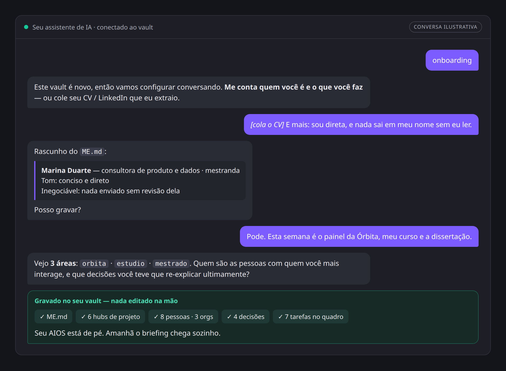

# 06 — Guia de Implementação (passo a passo)

*[English version → 06-implementation-guide.md](06-implementation-guide.md)*

Do zero a um AIOS funcionando em **7 fases**. Não precisa ser técnico: se você sabe copiar uma pasta e manter uma conversa, você consegue. Nada aqui é escrito na mão — depois que o template está no lugar, quem digita é a IA.

## O caminho de relance

| Fase | O que acontece | Tempo | O que você ganha |
|---|---|---|---|
| 0 | Instalar o Obsidian, escolher o assistente | 10 min | As duas ferramentas necessárias |
| 1 | Copiar o template para um vault | 10 min | A estrutura de pastas |
| 2 | Conectar a IA ao vault | 15 min | Um assistente que oferece o onboarding sozinho |
| 3 | **A conversa de onboarding** | 20–40 min | `ME.md`, áreas e hubs de projeto — **um AIOS funcionando** |
| 4 | Contar sobre pessoas e decisões | contínuo | Um cérebro que sabe quem é quem e o que foi decidido |
| 5 | Testar e agendar as skills | 30 min | Um briefing que chega sozinho |
| 6 | Visualização *(opcional)* | 15 min | Seu vault como grafo colorido / cérebro 3D |
| 7 | Setup de time *(opcional)* | ~1 h por projeto | Um cérebro de projeto compartilhado |

**Com pressa?** As fases 0–3 são o produto inteiro: cerca de uma hora, e você tem um sistema que dá boot com o seu contexto. Todo o resto acontece durante a primeira semana de uso normal.

**Quer ver o destino antes?** Abra [`examples/demo-vault`](../examples/demo-vault) como vault no Obsidian — é este guia já seguido, para uma operadora fictícia. Os screenshots abaixo vêm de lá.

---

## Fase 0 — Pré-requisitos (10 min)

- [ ] Instale o [Obsidian](https://obsidian.md) (gratuito).
- [ ] Escolha seu assistente de IA. Qualquer um destes funciona:
  - **Claude Desktop / Cowork** — conecte a pasta do vault diretamente (mais simples), ou
  - **Claude Desktop + MCP** — plugin **Local REST API** do Obsidian + um servidor `mcp-obsidian`, ou
  - Qualquer agente que leia/escreva arquivos na pasta do vault (Cursor, Copilot com acesso ao workspace, agente próprio).
- [ ] Opcional mas recomendado: `git` para versionar, e os plugins **obsidian-git**, **Dataview**, **Templater**.

> Decisão a tomar agora: **vault novo ou existente?** Vault novo → siga tudo em ordem. Vault existente → faça as fases 1–3 numa cópia primeiro; a fase 4 migra seu conteúdo *sem reorganizar pastas*.

## Fase 1 — Instalar o template (10 min)

1. Baixe o repo: `git clone https://github.com/Ecoa-PUC-Rio/AIOS` (ou o ZIP).
2. Crie/abra seu vault no Obsidian.
3. Copie **o conteúdo de** `vault-template/` para a raiz do vault. Você deve ter:
   ```
   <vault>/
   ├── CLAUDE.md          ← bootstrap da IA (boot + persistência)
   ├── ME.md              ← sua identidade (template)
   ├── AIOS/              ← Maps, Skills, Systems, History, Tasks, Inbox
   ├── People/  ├── Decisões/  └── Projetos/
   ```
4. Abra `AIOS/Maps/Vault Map.md` e leia por alto — é o mapa pelo qual a IA (e você) vai navegar.
5. Se usar git: `git init && git add . && git commit -m "AIOS bootstrap"`.

✅ **Checkpoint:** a estrutura existe e abre no Obsidian sem erros.

## Fase 2 — Conectar a IA (15 min)

1. Conecte o assistente ao vault:
   - **Cowork:** adicione o vault como pasta conectada.
   - **Rota MCP:** ative o plugin Local REST API no Obsidian → configure o `mcp-obsidian` com a API key → adicione à config de MCP do assistente.
2. Confirme o bootstrap: o `CLAUDE.md` deve estar na raiz do vault (ajuste o nome se seu assistente usa outra convenção, ex.: `AGENTS.md`).
3. Inicie uma conversa. Como o `ME.md` ainda tem placeholders, a IA deve detectar a instalação nova e **oferecer rodar a skill de Onboarding**.

🔧 **Se não funcionar:** confira se o assistente tem mesmo acesso aos arquivos; diga uma vez "leia o CLAUDE.md e siga" — e teste de novo em conversa nova.

✅ **Checkpoint:** a própria IA propõe: *"este vault é novo — vamos rodar o onboarding?"*

## Fase 3 — A conversa de onboarding (20–40 min)

**Você não preenche arquivo nenhum na mão.** Diga **"onboarding"** e deixe a IA entrevistar você — a [skill de Onboarding](../vault-template/AIOS/Skills/Onboarding.md) conduz, rascunha cada nota, mostra, e só grava depois do seu OK:

1. **Identidade** — fale de você, ou simplesmente cole seu **CV / perfil do LinkedIn** e deixe a IA extrair. Perguntas de acompanhamento só para o que faltar (como gosta de trabalhar, tom, inegociáveis). → grava o `ME.md`.
2. **Áreas e projetos** — descreva o que ocupa sua semana, com suas palavras. A IA propõe 3–5 áreas (donos), valida com você (*todo* projeto pertence a exatamente uma) e cria um hub por projeto ativo com `type: project`, `area: <x>`, prazo e descrição de uma linha. → grava hubs + seção de projetos do `ME.md` + tabela do Vault Map.
3. Placeholder é aceitável: se você não souber responder algo, a IA registra `<a definir>` e segue. Pode rodar "onboarding" de novo quando quiser — ela detecta o que existe e só complementa.



<sub>Ilustrativo — a sua conversa acontece no seu assistente e segue estas mesmas etapas.</sub>

✅ **Checkpoint:** lendo só o `ME.md`, um estranho (ou um LLM) saberia dizer quem você é, no que trabalha e o que vence este mês — e você não abriu um arquivo sequer.


## Fase 4 — Semear o cérebro, conversando (parte do onboarding, depois contínuo)

Pessoas e decisões também entram **por conversa**, nunca por edição de arquivo — o onboarding cobre a primeira leva, e o dia a dia faz crescer a partir daí:

1. **People:** conte à IA quem são as 5–10 pessoas com quem você mais interage — papel, org, projeto. Ela cria as notas em `People/` (orgs em `People/Orgs/`) e linka a partir dos hubs.
2. **Decisões:** conte 2–3 decisões que você teve que re-explicar recentemente. Ela registra como `DEC-AAAA-001…` com contexto → decisão → consequências.
3. Daí em diante as regras de ouro também rodam em conversa: *"decidimos X" → a IA oferece registrar a DEC no mesmo dia; nome novo aparece num projeto → ela oferece a nota em People/*.
4. Editar o markdown na mão continua sempre possível — é o fallback, não o fluxo.

✅ **Checkpoint:** pergunte à IA "quem está envolvido no projeto X e o que já decidimos sobre ele?" — a resposta deve vir de People/ e Decisões/, não de suposição.

## Fase 5 — Ligar as skills (30 min + agendamento)

1. Teste cada skill manualmente no chat, nesta ordem:
   - `"captura: testar a skill de captura"` → conferir a linha em `AIOS/Inbox.md`.
   - `"start"` → panorama (já testado).
   - `"daily briefing"` → conferir a nota em `AIOS/History/`.
   - `"weekly review"` → conferir que ela percorre Kanban e Inbox.
2. Peça à IA para colocar no Kanban as 3–5 tarefas reais que surgiram no onboarding (prioridade + hashtag de projeto), para o briefing ter o que dizer.
3. **Agende** (no agendador do seu assistente — ex.: scheduled tasks do Claude): Daily Briefing nas manhãs de dia útil; Weekly Review sexta à tarde.
4. **Só agora**, e só depois de ler [04-security.pt-BR](04-security.pt-BR.md): conecte e-mail e agenda, **read-only**, e teste `"triagem de e-mail"`.

✅ **Checkpoint:** amanhã de manhã existe uma nota de briefing em `History/` que você não pediu.


## Fase 6 — Camada de visualização (opcional, 15 min)

1. Instale o plugin **Brain Atlas**; mescle `plugin-configs/brain-atlas.data.json` nas configurações; recarregue o Obsidian → seu vault vira um cérebro (projetos/decisões no frontal, pessoas no temporal, fontes no occipital…). Regiões vazias = lacunas honestas do seu cérebro.
2. Graph view → crie um grupo de cor por área usando `plugin-configs/graph.colorGroups.json` como referência → o dono de cada nó fica visível de relance.


## Fase 7 — Time / ambiente de projeto (por projeto, ~1 h)

1. Crie um **vault novo por projeto**, copie o template e renomeie `ME.md` → `PROJECT.md` (ajuste o `CLAUDE.md`): missão, escopo, stakeholders, marcos, convenções.
2. Áreas = frentes de trabalho ou organizações parceiras. `People/` = mapa de stakeholders com alçadas. `Decisões/` = o ADR do projeto (semeie com as decisões já tomadas — nome, stack, escopo).
3. Adapte as skills aos rituais do time: Daily Briefing → preparação de standup; Weekly Review → fechamento de sprint; Status Semanal → o relatório que os stakeholders já esperam.
4. Versione o vault num repo git compartilhado; cada membro conecta o próprio assistente ao seu clone. Mesma identidade, mesmo mapa, mesmas regras — **o projeto é o usuário**.
5. Adicione as restrições de dados do projeto (NDA/LGPD) à nota de Guardrails. Elas valem para o assistente de todos os membros.

## Ritmo da semana 1 (resumo)

| Dia | Fazer |
|---|---|
| D1 | Fases 1–3. A IA faz seu onboarding; boot funcionando. |
| D2 | Fase 4 em conversa: primeiras notas de People e decisões. Capturar tudo ("captura: …"). |
| D3 | Fase 5: skills testadas, briefing agendado. |
| D4 | Primeiros 3 registros de decisão. E-mail/agenda read-only (após o doc de segurança). |
| D5 | Primeiro Weekly Review. Fase 6 de visualização. Ajustar o que incomodou — skill é só markdown. |

## Troubleshooting

- **A IA não dá boot com contexto** → `CLAUDE.md` ausente/renomeado, ou o assistente não tem acesso aos arquivos. Teste com um "leia o CLAUDE.md" explícito.
- **Briefing inchado** → aperte a seção "Regras" da skill Daily Briefing (ela é sua para editar); limite a janela de e-mail.
- **Notas na região errada do Brain Atlas** → confira o valor de `type` e o value map do plugin; lembre a precedência: value map → type → tags → pasta.
- **O sistema esfriou depois de duas semanas** → você pulou um Weekly Review. Essa skill é o loop de manutenção; agende, não dependa de força de vontade.
